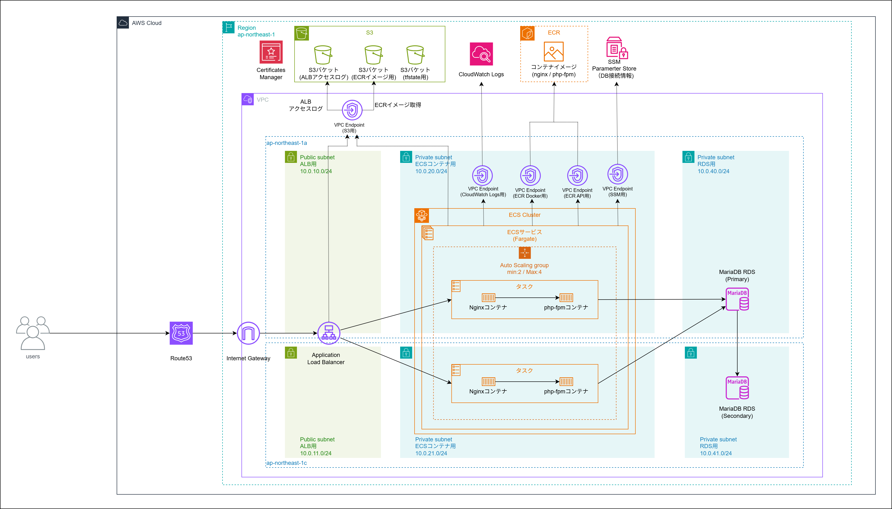

# 基本設計書 <!-- omit from toc -->

# 目次 <!-- omit from toc -->
- [1. システム概要](#1-システム概要)
- [2. アカウント設計](#2-アカウント設計)
  - [2.1. AWSアカウント設計](#21-awsアカウント設計)
  - [2.2. リージョン設計](#22-リージョン設計)
  - [2.3. Terraform state設計](#23-terraform-state設計)
- [3. 命名規則](#3-命名規則)
  - [命名規則（共通ルール）](#命名規則共通ルール)
  - [ネットワーク系](#ネットワーク系)
  - [セキュリティ系](#セキュリティ系)
  - [コンテナ / アプリケーション系（ECS / ALB）](#コンテナ--アプリケーション系ecs--alb)
  - [データベース / ストレージ系（RDS / S3）](#データベース--ストレージ系rds--s3)
  - [CI/CD系（GitHub Actions / ECR](#cicd系github-actions--ecr)
- [4. 利用サービスおよびコスト設計](#4-利用サービスおよびコスト設計)
  - [4.1. 利用サービスおよび月額コスト試算](#41-利用サービスおよび月額コスト試算)
  - [4.2. コスト削減の工夫](#42-コスト削減の工夫)
  - [4.3. コストアラート設定](#43-コストアラート設定)
- [5. ネットワーク設計](#5-ネットワーク設計)
  - [5.1. 概要](#51-概要)
  - [5.2. VPC設計](#52-vpc設計)
  - [5.3. サブネット設計](#53-サブネット設計)
  - [5.4. インターネットゲートウェイ設計](#54-インターネットゲートウェイ設計)
  - [5.5. ルートテーブル設計](#55-ルートテーブル設計)
    - [パブリック用ルートテーブル（両AZ共通）](#パブリック用ルートテーブル両az共通)
    - [プライベート用ルートテーブル（両AZ共通）](#プライベート用ルートテーブル両az共通)
  - [5.6. VPCエンドポイント設計](#56-vpcエンドポイント設計)
    - [コスト比較（月額概算）](#コスト比較月額概算)
    - [エンドポイント一覧](#エンドポイント一覧)
    - [エンドポイントのセキュリティグループ](#エンドポイントのセキュリティグループ)
  - [5.7. セキュリティグループ設計](#57-セキュリティグループ設計)
    - [ALB用（`dev-portfolio-alb-sg`）](#alb用dev-portfolio-alb-sg)
    - [ECS用（`dev-portfolio-ecs-sg`）](#ecs用dev-portfolio-ecs-sg)
    - [RDS用（`dev-portfolio-rds-sg`）](#rds用dev-portfolio-rds-sg)
    - [VPCエンドポイント用（`dev-portfolio-vpce-sg`）](#vpcエンドポイント用dev-portfolio-vpce-sg)
- [6. コンテナ設計](#6-コンテナ設計)
  - [6.1. 概要](#61-概要)
  - [6.2. ECS クラスター設計](#62-ecs-クラスター設計)
  - [6.3. タスク定義設計](#63-タスク定義設計)
    - [6.3.1. サイジング根拠](#631-サイジング根拠)
    - [6.3.2. タスク定義概要](#632-タスク定義概要)
    - [6.3.3. コンテナ定義（nginxコンテナ）](#633-コンテナ定義nginxコンテナ)
    - [6.3.4. コンテナ定義（PHP-FPMコンテナ）](#634-コンテナ定義php-fpmコンテナ)
    - [6.3.5. 環境変数・シークレット設計](#635-環境変数シークレット設計)
  - [6.4. ECS サービス設計](#64-ecs-サービス設計)
  - [6.5. Auto Scaling設計](#65-auto-scaling設計)
    - [採用の背景](#採用の背景)
    - [設定値](#設定値)
    - [コスト影響](#コスト影響)
  - [6.6. ECR リポジトリ設計](#66-ecr-リポジトリ設計)
  - [6.7. コンテナ間通信設計](#67-コンテナ間通信設計)
  - [6.8. Dockerfile 方針](#68-dockerfile-方針)
    - [nginxコンテナ（`./infra/nginx/`）](#nginxコンテナinfranginx)
    - [PHP-FPMコンテナ（`./infra/php/`）](#php-fpmコンテナinfraphp)
  - [6.9. CI/CD との連携](#69-cicd-との連携)
- [7. データベース設計](#7-データベース設計)
  - [7.1. 概要](#71-概要)
  - [7.2. RDS インスタンス設計](#72-rds-インスタンス設計)
    - [インスタンスクラス選定根拠（本番運用での妥当性）](#インスタンスクラス選定根拠本番運用での妥当性)
  - [7.3. ストレージ設計](#73-ストレージ設計)
    - [ストレージタイプ選定理由（gp2 vs gp3）](#ストレージタイプ選定理由gp2-vs-gp3)
    - [gp3で十分な根拠（実測値）](#gp3で十分な根拠実測値)
  - [7.4. ネットワーク・アクセス設計](#74-ネットワークアクセス設計)
  - [7.5. 認証・接続設計](#75-認証接続設計)
  - [7.6. バックアップ・メンテナンス設計](#76-バックアップメンテナンス設計)
  - [7.7. パラメータグループ設計](#77-パラメータグループ設計)
  - [7.8. マルチAZ・フェールオーバー設計](#78-マルチazフェールオーバー設計)
    - [マルチAZ採用の目的](#マルチaz採用の目的)
    - [フェールオーバーの動作](#フェールオーバーの動作)
    - [フェールオーバー試験の方針](#フェールオーバー試験の方針)
  - [7.9. ローカル環境との対応関係](#79-ローカル環境との対応関係)
- [8. ストレージ設計（S3）](#8-ストレージ設計s3)
  - [8.1. 概要](#81-概要)
  - [8.2. ALBアクセスログバケット（`com-infra-nikki-dev-portfolio-s3-alb-logs-<suffix>`）](#82-albアクセスログバケットcom-infra-nikki-dev-portfolio-s3-alb-logs-<suffix>)
  - [8.3. Terraform stateバケット（`com-infra-nikki-portfolio-artifact-bucket`）](#83-terraform-stateバケットcom-infra-nikki-portfolio-artifact-bucket)
  - [8.4. AWS Config用バケット](#84-aws-config用バケット)
- [9. サービス設計](#9-サービス設計)
  - [9.1. 概要](#91-概要)
  - [9.2. ALB設計](#92-alb設計)
  - [9.3. リスナー設計](#93-リスナー設計)
    - [リスナー①：HTTP（port 80）](#リスナーhttpport-80)
    - [リスナー②：HTTPS（port 443）](#リスナーhttpsport-443)
  - [9.4. ターゲットグループ設計](#94-ターゲットグループ設計)
  - [9.5. ACM（SSL/TLS証明書）設計](#95-acmssltls証明書設計)
  - [9.6. Route53設計](#96-route53設計)
    - [ホストゾーン](#ホストゾーン)
    - [DNSレコード設計](#dnsレコード設計)
  - [9.7. アクセスログ設計](#97-アクセスログ設計)
- [10. セキュリティ設計](#10-セキュリティ設計)
  - [10.1. IAM設計](#101-iam設計)
    - [基本方針](#基本方針)
    - [10.1.1. IAMグループ設計](#1011-iamグループ設計)
    - [10.1.2. IAMユーザー設計](#1012-iamユーザー設計)
    - [10.1.3. IAMロール設計](#1013-iamロール設計)
  - [10.2. ルートユーザー管理](#102-ルートユーザー管理)
  - [10.3. CloudTrail設計](#103-cloudtrail設計)
  - [10.4. AWS Config設計](#104-aws-config設計)
  - [10.5. 予算設計](#105-予算設計)


# 1. システム概要



# 2. アカウント設計
## 2.1. AWSアカウント設計
- 本ポートフォリオは学習目的であることを考慮し、AWSアカウントはシングルアカウント構成とする。
- 本ポートフォリオは学習目的であることを考慮し、サポートプランはベーシックプランとする。
- 本ポートフォリオでは、以下のAWSアカウントを利用する。

| 項目 | 値 | 備考 |
| --- | --- | --- |
| メールアドレス | *****@***.com | Gmailのエイリアス利用(+) |
| AWSアカウントID | xxxxxxxxxxxx | - |
| AWSアカウント名 | xxxxxxxxxxxx | AWSアカウント名に+は利用不可 |
| ルートユーザパスワード | （省略） | - |


## 2.2. リージョン設計
- 本ポートフォリオで構築するシステムは、日本国内の企業での利用を想定し、東京リージョン（ap-northeast-1）を利用する。
- 本ポートフォリオは学習目的であるため、コスト削減および構成の簡素化を目的として、マルチリージョン構成は採用しない。
  
## 2.3. Terraform state設計
- IaCの状態管理を目的として、TerraformのstateファイルはS3に保存する。
- 学習用途であることを考慮し、本ポートフォリオで利用するAWSアカウント内にstate管理用のS3バケットを作成する。
- バケットはTerraform state専用とする。
- バージョニングを有効化する。
- パブリックアクセスはすべてブロックする。
- DynamoDBテーブルを使用したステートロックを実装し、Terraform実行の並行実行による競合を防止する。

# 3. 命名規則
## 命名規則（共通ルール）
- 英小文字とハイフン（-）を使用する
- 単語の区切りはハイフンで統一する
- 環境名は必ず含める
- AWSリソース種別が識別できる名称とする
- 本システムは谷津リージョン構成を前提とするため、リージョン名は命名規則には含めない。
- AZに依存しないマネージドサービスについては、命名にAZ情報は含めない。
命名規則は以下の形式を基本とする。
```
# VPC
<env>-<system>-<category>-<type>
dev-portfolio-network-vpc

# VPCの子リソース（サブネット等）
<env>-<system>-<category>-<parent-type>-<purpose>-<az>
dev-portfolio-network-vpc-public-subnet-a


# VPCに紐づくが独立したリソース（IGW・RT等）
<env>-<system>-<category>-<type>-<purpose>
dev-portfolio-network-igw
dev-portfolio-network-rt-public

# EC2そのほか
<env>-<system>-<purpose>-<type>
dev-portfolio-bastion-ec2

```
ただし、AZに依存しないリソースについては <az> を省略し、
単一または一意に存在するリソースについては <no> を省略する。

## ネットワーク系
| サービス | category | リソース種別 | AZ | purpose | 命名例 |
| --- | --- | --- | --- | --- | --- |
| VPC | network | vpc | - | - | `dev-portfolio-network-vpc` |
| Subnet | network | subnet-public | a | - | `dev-portfolio-network-subnet-public-a` |
| Subnet | network | subnet-public | c | - | `dev-portfolio-network-subnet-public-c` |
| Subnet | network | subnet-private-app | a | - | `dev-portfolio-network-subnet-private-app-a` |
| Subnet | network | subnet-private-app | c | - | `dev-portfolio-network-subnet-private-app-c` |
| Subnet | network | subnet-private-db | a | - | `dev-portfolio-network-subnet-private-db-a` |
| Subnet | network | subnet-private-db | c | - | `dev-portfolio-network-subnet-private-db-c` |
| Internet Gateway | network | igw | - | - | `dev-portfolio-network-igw` |
| Route Table | network | rt-public | - | - | `dev-portfolio-network-rt-public` |
| Route Table | network | rt-private | - | - | `dev-portfolio-network-rt-private` |
| Security Group | network | alb-sg | - | - | `dev-portfolio-network-alb-sg` |
| Security Group | network | ecs-sg | - | - | `dev-portfolio-network-ecs-sg` |
| Security Group | network | rds-sg | - | - | `dev-portfolio-network-rds-sg` |
| Security Group | network | vpce-sg | - | - | `dev-portfolio-network-vpce-sg` |
| Security Group | bastion | sg | - | - | `dev-portfolio-bastion-sg` |

## セキュリティ系
| サービス           | リソース種別        | AZ | No | 命名例                           |
| -------------- | ------------- | -- | -- | ----------------------------- |
| IAM Role       | ecs-task-role | -  | -  | `dev-portfolio-identity-ecs-task-role` |
| IAM Role       | ecs-exec-role | -  | -  | `dev-portfolio-identity-ecs-exec-role` |


## コンテナ / アプリケーション系（ECS / ALB）
| サービス                | リソース種別        | AZ | No | 命名例                                |
| ------------------- | ------------- | -- | -- | ---------------------------------- |
| ECS Cluster         | cluster       | -  | -  | `dev-portfolio-container-ecs-cluster`  |
| ECS Service         | service       | -  | -  | `dev-portfolio-container-ecs-service`  |
| ECS Task Definition | task          | -  | -  | `dev-portfolio-container-ecs-task`     |
| ALB                 | alb           | -  | -  | `dev-portfolio-network-alb`            |
| Target Group (Blue) | tg-blue       | -  | -  | `dev-portfolio-tg-blue`                |
| Target Group (Green)| tg-green      | -  | -  | `dev-portfolio-tg-green`               |
| Listener            | listener-http | -  | -  | `dev-portfolio-alb-listener-http`      |

## データベース / ストレージ系（RDS / S3）
| サービス             | リソース種別       | AZ | No | 命名例                              |
| ---------------- | ------------ | -- | -- | -------------------------------- |
| RDS Instance     | rds              | -  | -  | `dev-portfolio-database-rds`             |
| RDS Subnet Group | rds-subnet-group | -  | -  | `dev-portfolio-database-rds-subnet-group` |
| S3 Bucket        | artifact     | -  | -  | `com-infra-nikki-portfolio-artifact-bucket`  |
| S3 Bucket        | log          | -  | -  | `com-infra-nikki-dev-portfolio-s3-alb-logs-<suffix>`       |

## CI/CD系（GitHub Actions / ECR
| サービス              | リソース種別 | AZ | No | 命名例                     |
| ----------------- | ------ | -- | -- | ----------------------- |
| ECR Repository (nginx) | ecr-nginx | -  | -  | `dev-portfolio-container-ecr-nginx` |
| ECR Repository (app)   | ecr-app   | -  | -  | `dev-portfolio-container-ecr-app`   |
| GitHub Repository | infra  | -  | -  | `portfolio-infra`       |
| GitHub Repository | app    | -  | -  | `portfolio-app`         |


# 4. 利用サービスおよびコスト設計

## 4.1. 利用サービスおよび月額コスト試算

| サービス | 用途 | スペック/設定 | 月額（USD） | 備考 |
| --- | --- | --- | --- | --- |
| Amazon ECS（Fargate） | アプリ実行 | 0.5vCPU / 1GB × 2タスク | 35.55 | |
| Amazon RDS（MariaDB） | データベース | db.t3.micro / マルチAZ / gp3 20GB | 26.78 | |
| Application Load Balancer | ロードバランサー | - | 17.50 | |
| VPC エンドポイント（Interface） | ECR/SSM/CloudWatch Logs通信 | 4エンドポイント × 1AZ | 40.32 | |
| Amazon ECR | コンテナイメージ保存 | - | 0.20 | |
| Amazon Route53 | DNS管理 | パブリックホストゾーン × 1 | 0.54 | |
| AWS Certificate Manager | SSL/TLS証明書 | パブリック証明書 | 無料 | |
| Amazon S3 | ログ・Terraform state | - | 0.03 | |
| Amazon CloudWatch Logs | コンテナログ | - | 0.86 | |
| AWS CodeDeploy | Blue/Greenデプロイ | ECS向け | 無料 | |
| AWS CloudTrail | 操作ログ | 管理イベント | 無料 | 管理イベント1証跡は無料 |
| **合計(USD)** | | | **121.78** | |
| **合計(JPY換算 1USD=150)** | | | **18,267** | |

## 4.2. コスト削減の工夫

| 工夫 | 内容 | 削減効果 |
| --- | --- | --- |
| VPCエンドポイントをNATゲートウェイの代替に採用 | NATゲートウェイ（約$45/月）の代わりにVPCエンドポイント1AZ配置（約$40/月）を採用 | 約$5/月削減・安定したIOPS確保 |
| VPCエンドポイントを1AZのみに配置 | 2AZ配置（約$80/月）から1AZ配置（約$40/月）に絞ることでコストを半減 | 約$40/月削減 |
| RDSインスタンスクラスをt3.microに設定 | 実測・データ量試算により本番運用でもt3.microで十分と判断 | 上位クラス比で削減 |
| ECRライフサイクルポリシーで直近10世代のみ保持 | 古いイメージを自動削除してストレージコストを抑制 | ストレージ削減 |
| ALBアクセスログのライフサイクルを90日に設定 | S3ストレージコストを抑制 | ストレージ削減 |

## 4.3. コストアラート設定

| 項目 | 値 | 備考 |
| --- | --- | --- |
| 利用ツール | AWS Budgets | |
| 月額予算 | 20,000円 | 試算合計を踏まえた上限として設定 |
| アラート閾値① | 予算の80%（16,00円）到達時 | 事前通知 |
| アラート閾値② | 予算の100%（20,000円）到達時 | 超過通知 |
| 通知先 | メールアドレス | AWSアカウントのメールアドレスに通知 |


# 5. ネットワーク設計

## 5.1. 概要

本システムのネットワークは東京リージョン（ap-northeast-1）のシングルVPC構成とする。  
パブリックサブネットにALBを、プライベートサブネットにECSタスクおよびRDSを配置し、  
インターネットからECSタスク・RDSへの直接アクセスを遮断する。

ECSタスクからECR・SSM・CloudWatch Logsへのアウトバウンド通信は  
NATゲートウェイを使用せずVPCエンドポイント経由で行う。  
コスト削減を目的としてエンドポイントは1AZ（ap-northeast-1a）のみに配置する。

```
                        ap-northeast-1
┌───────────────────────────────────────────────────────────┐
│  VPC（10.0.0.0/16）                                       │
│                                                          │
│  ┌─────────────────────┐  ┌─────────────────────┐        │
│  │ パブリックサブネット  │  │ パブリックサブネット  │        │
│  │ 10.0.10.0/24        │  │ 10.0.11.0/24        │        │
│  │ ap-northeast-1a     │  │ ap-northeast-1c     │        │
│  │  [ALB]              │  │  [ALB]              │        │
│  └──────────┬──────────┘  └──────────┬──────────┘        │
│             │                        │                   │
│  ┌──────────▼──────────┐  ┌──────────▼──────────┐        │
│  │ プライベートサブネット│  │ プライベートサブネット│        │
│  │ ECS: 10.0.20.0/24   │  │ ECS: 10.0.21.0/24   │        │
│  │ RDS: 10.0.40.0/24   │  │ RDS: 10.0.41.0/24   │        │
│  │ ap-northeast-1a     │  │ ap-northeast-1c     │        │
│  │  [ECS Task]         │  │  [ECS Task]         │        │
│  │  [VPC Endpoints]    │  │                     │        │
│  │  [RDS Primary]      │  │  [RDS Standby]      │        │
│  └─────────────────────┘  └─────────────────────┘        │
│                                                           │
│  [Internet Gateway]                                       │
└───────────────────────────────────────────────────────────┘
```

## 5.2. VPC設計

| 項目 | 値 | 備考 |
| --- | --- | --- |
| VPC名 | `dev-portfolio-network-vpc` | 命名規則に準拠 |
| CIDRブロック | `10.0.0.0/16` | 最大65,534ホスト |
| DNSホスト名 | 有効 | VPCエンドポイント利用に必要 |
| DNSサポート | 有効 | VPCエンドポイント利用に必要 |

## 5.3. サブネット設計

| サブネット名 | CIDR | AZ | 用途 |
| --- | --- | --- | --- |
| `dev-portfolio-network-subnet-public-a` | `10.0.10.0/24` | ap-northeast-1a | ALB |
| `dev-portfolio-network-subnet-public-c` | `10.0.11.0/24` | ap-northeast-1c | ALB |
| `dev-portfolio-network-subnet-private-app-a` | `10.0.20.0/24` | ap-northeast-1a | ECS / VPCエンドポイント |
| `dev-portfolio-network-subnet-private-app-c` | `10.0.21.0/24` | ap-northeast-1c | ECS |
| `dev-portfolio-network-subnet-private-db-a` | `10.0.40.0/24` | ap-northeast-1a | RDS Primary |
| `dev-portfolio-network-subnet-private-db-c` | `10.0.41.0/24` | ap-northeast-1c | RDS Standby |

**CIDRの割り当て方針：**  
`/24`（256アドレス）で統一する。AWSが予約する5アドレスを除いた251アドレスが利用可能。  
ECS用とRDS用でサブネットを分離し、セキュリティグループによる通信制御を明確化する。

第3オクテットはサブネットの役割・層・AZを示す。
- **十の位**：ネットワーク層を表す（`1x` = パブリック、`2x` = プライベート（Web/AP）、`3x` = プライベート（AP）※Web/AP分離時に使用、`4x` = プライベート（DB））
- **一の位**：AZを表す（`0` = ap-northeast-1a、`1` = ap-northeast-1c）

## 5.4. インターネットゲートウェイ設計

| 項目 | 値 | 備考 |
| --- | --- | --- |
| IGW名 | `dev-portfolio-network-igw` | 命名規則に準拠 |
| アタッチ先VPC | `dev-portfolio-network-vpc` | |
| 用途 | パブリックサブネットからのインターネット通信 | ALBのインターネット向け通信 |

## 5.5. ルートテーブル設計

### パブリック用ルートテーブル（両AZ共通）

| ルートテーブル名 | 関連サブネット |
| --- | --- |
| `dev-portfolio-network-rt-public` | subnet-public-a / subnet-public-c |

| 送信先 | ターゲット | 備考 |
| --- | --- | --- |
| `10.0.0.0/16` | local | VPC内通信 |
| `0.0.0.0/0` | Internet Gateway | インターネット向け通信 |

### プライベート用ルートテーブル（両AZ共通）

NATゲートウェイは使用せず、インターネット向けルートは設定しない。  
AWS各サービスへの通信はVPCエンドポイント経由で行う。

| ルートテーブル名 | 関連サブネット |
| --- | --- |
| `dev-portfolio-network-rt-private` | subnet-private-app-a / subnet-private-app-c / subnet-private-db-a / subnet-private-db-c |

| 送信先 | ターゲット | 備考 |
| --- | --- | --- |
| `10.0.0.0/16` | local | VPC内通信 |
| `pl-xxxxxxxx`（S3のPrefix List） | VPCエンドポイント（S3） | S3向け通信 |

## 5.6. VPCエンドポイント設計

NATゲートウェイとのコスト比較を行い、VPCエンドポイント（1AZのみ配置）を採用する。

### コスト比較（月額概算）

| 方式 | 月額概算 | 備考 |
| --- | --- | --- |
| NATゲートウェイ（シングルAZ） | 約$45 | 固定費のみ・データ転送費別途 |
| VPCエンドポイント（2AZ） | 約$80 | Interface型4つ×2AZ |
| **VPCエンドポイント（1AZ）** | **約$50** | **Interface型5つ×1AZ（採用）** |

**1AZ配置のトレードオフ：**  
ap-northeast-1aのエンドポイントに障害が発生した場合、1cのECSタスクからの  
ECR/SSM/CloudWatch Logsへの通信が影響を受ける可能性がある。  
ただし本ポートフォリオの用途・規模ではコスト優先と判断し1AZ配置を採用する。
障害発生時はTerraformのモジュール化されたコードにより、ap-northeast-1c への速やかな切り替えを可能とする。（詳細はTerraform設計書に記載予定）

### エンドポイント一覧

| エンドポイント名 | タイプ | サービス名 | 配置サブネット | 用途 |
| --- | --- | --- | --- | --- |
| `dev-portfolio-ecr-api-endpoint` | Interface | `com.amazonaws.ap-northeast-1.ecr.api` | private-subnet-a-01 | ECRイメージメタデータ取得 |
| `dev-portfolio-ecr-dkr-endpoint` | Interface | `com.amazonaws.ap-northeast-1.ecr.dkr` | private-subnet-a-01 | ECRイメージpull |
| `dev-portfolio-ssm-endpoint` | Interface | `com.amazonaws.ap-northeast-1.ssm` | private-subnet-a-01 | SSM Parameter Store参照（アプリからDBパスワード等を取得） |
| `dev-portfolio-ssmmessages-endpoint` | Interface | `com.amazonaws.ap-northeast-1.ssmmessages` | private-subnet-a-01 | SSM Session Manager通信（bastionへのSSMセッション・ECS Exec用） |
| `dev-portfolio-logs-endpoint` | Interface | `com.amazonaws.ap-northeast-1.logs` | private-subnet-a-01 | CloudWatch Logsへのログ出力 |
| `dev-portfolio-s3-endpoint` | Gateway | `com.amazonaws.ap-northeast-1.s3` | - | ECRイメージレイヤー取得（無料） |

**S3エンドポイントはGateway型のため追加料金なし。配置AZの制約もない。**

### エンドポイントのセキュリティグループ

| SG名 | インバウンド | 対象 |
| --- | --- | --- |
| `dev-portfolio-network-vpce-sg` | HTTPS（443）/ ECS SGから | Interface型エンドポイント共通 |

## 5.7. セキュリティグループ設計

### ALB用（`dev-portfolio-network-alb-sg`）

| 方向 | プロトコル | ポート | 送信元/送信先 | 備考 |
| --- | --- | --- | --- | --- |
| インバウンド | TCP | 80 | `0.0.0.0/0` | HTTPリクエスト受信（HTTPSへリダイレクト） |
| インバウンド | TCP | 443 | `0.0.0.0/0` | HTTPSリクエスト受信 |
| アウトバウンド | TCP | 80 | ECS SG | ECSタスクへの転送 |

### ECS用（`dev-portfolio-network-ecs-sg`）

| 方向 | プロトコル | ポート | 送信元/送信先 | 備考 |
| --- | --- | --- | --- | --- |
| インバウンド | TCP | 80 | ALB SG | ALBからのリクエストのみ許可 |
| アウトバウンド | TCP | 443 | VPCエンドポイント SG | ECR/SSM/CloudWatch Logs |
| アウトバウンド | TCP | 443 | S3 Prefix List | ECRイメージレイヤー取得 |
| アウトバウンド | TCP | 3306 | RDS SG | DBへの接続 |

### RDS用（`dev-portfolio-network-rds-sg`）

| 方向 | プロトコル | ポート | 送信元/送信先 | 備考 |
| --- | --- | --- | --- | --- |
| インバウンド | TCP | 3306 | ECS SG | ECSタスクからのDB接続のみ許可 |
| アウトバウンド | - | - | - | 不要（設定なし） |

### VPCエンドポイント用（`dev-portfolio-network-vpce-sg`）

| 方向 | プロトコル | ポート | 送信元/送信先 | 備考 |
| --- | --- | --- | --- | --- |
| インバウンド | TCP | 443 | ECS SG | ECSタスクからのHTTPS通信のみ許可 |
| アウトバウンド | - | - | - | 不要（設定なし） |


# 6. コンテナ設計

## 6.1. 概要

本システムのアプリケーション基盤には Amazon ECS（Fargate）を採用する。  
nginx と PHP-FPM を1つのタスク定義内に2コンテナとして配置し、nginx がリバースプロキシとして PHP-FPM にリクエストを転送する構成とする。

```
インターネット
    │
   ALB
    │  HTTP/HTTPS
    ▼
┌─────────────────────────────────────┐
│  ECS Task（Fargate）                 │
│                                     │
│  ┌─────────────┐   Unix Socket or   │
│  │   nginx     │──────────────────▶ │
│  │ (port 80)   │   localhost:9000   │
│  └─────────────┘                    │
│         │                           │
│  ┌─────────────┐                    │
│  │  PHP-FPM    │                    │
│  │ (port 9000) │                    │
│  └─────────────┘                    │
└─────────────────────────────────────┘
    │
   RDS（MariaDB互換）
```

## 6.2. ECS クラスター設計

| 項目 | 値 | 備考 |
| --- | --- | --- |
| クラスター名 | `dev-portfolio-container-ecs-cluster` | 命名規則に準拠 |
| 起動タイプ | Fargate | サーバー管理不要 |
| 対応AZ | ap-northeast-1a / ap-northeast-1c | マルチAZ構成 |

## 6.3. タスク定義設計

### 6.3.1. サイジング根拠

ローカル環境にて実際のアプリ操作（サブネット追加：254レコードの一括INSERT、サブネット削除）実施時の `docker stats` 実測値は以下の通り。

| コンテナ | CPU % | メモリ使用量 | 備考 |
| --- | --- | --- | --- |
| nginx（web） | 0.00% | 約 8MB | |
| PHP-FPM（app） | 0.01% | 約 38MB | |
| DB（参考） | 0.04% | 約 141MB | AWSではRDSのため参考値 |

nginx + PHP-FPM の合計実測値は **約46MB**。  
本番環境では同時接続10程度を想定し、Laravelの1リクエストあたりのメモリ消費（20〜50MB）および  
PHP-FPMワーカーの増加を考慮してバッファを確保し、**0.5vCPU / 1GB** を選定する。

| 案 | スペック | 月額コスト目安（2タスク） | 判定 |
| --- | --- | --- | --- |
| 最小案 | 0.25vCPU / 0.5GB | 約 $10 | 実測上は動作するが本番負荷時リスクあり |
| 採用案 | 0.5vCPU / 1GB | 約 $20 | 実測値に対して十分なバッファあり ✓ |

### 6.3.2. タスク定義概要

| 項目 | 値 | 備考 |
| --- | --- | --- |
| タスク定義名 | `dev-portfolio-container-ecs-task` | 命名規則に準拠 |
| 起動タイプ | Fargate | |
| OS / アーキテクチャ | Linux / X86_64 | |
| タスク CPU | 0.5 vCPU | 2コンテナ合計 |
| タスクメモリ | 1024 MB（1 GB） | 2コンテナ合計 |
| タスクロール | `dev-portfolio-identity-ecs-task-role` | アプリからAWSサービスへのアクセス用 |
| 実行ロール | `dev-portfolio-identity-ecs-exec-role` | ECRイメージ取得・CloudWatch Logs書き込み用 |
| ネットワークモード | awsvpc | Fargate必須 |

### 6.3.3. コンテナ定義（nginxコンテナ）

| 項目 | 値 | 備考 |
| --- | --- | --- |
| コンテナ名 | `nginx` | |
| イメージ | `<account-id>.dkr.ecr.ap-northeast-1.amazonaws.com/dev-portfolio-container-ecr-nginx:latest` | ECRから取得 |
| CPU | 256 units（0.25 vCPU） | |
| メモリ | 512 MB | |
| ポートマッピング | 80（TCP） | ALBからのトラフィック受信 |
| 必須コンテナ | true | PHP-FPMと依存関係あり |
| ログ設定 | awslogs | CloudWatch Logs に出力 |
| ロググループ | `/ecs/dev-portfolio-nginx` | |

### 6.3.4. コンテナ定義（PHP-FPMコンテナ）

| 項目 | 値 | 備考 |
| --- | --- | --- |
| コンテナ名 | `php-fpm` | |
| イメージ | `<account-id>.dkr.ecr.ap-northeast-1.amazonaws.com/dev-portfolio-container-ecr-app:latest` | ECRから取得 |
| CPU | 256 units（0.25 vCPU） | |
| メモリ | 512 MB | |
| ポートマッピング | 9000（TCP） | nginx からの内部通信のみ（外部公開なし） |
| 必須コンテナ | true | |
| ログ設定 | awslogs | CloudWatch Logs に出力 |
| ロググループ | `/ecs/dev-portfolio-php-fpm` | |

### 6.3.5. 環境変数・シークレット設計

DB接続情報等の機密情報はコンテナイメージに含めず、AWS Systems Manager Parameter Store（SSM）または Secrets Manager で管理し、タスク定義から参照する。

| 変数名 | 管理方法 | 備考 |
| --- | --- | --- |
| `APP_KEY` | SSM Parameter Store（SecureString） | Laravelアプリケーションキー |
| `DB_HOST` | SSM Parameter Store | RDSエンドポイント |
| `DB_DATABASE` | SSM Parameter Store | データベース名 |
| `DB_USERNAME` | SSM Parameter Store | DBユーザー名 |
| `DB_PASSWORD` | SSM Parameter Store（SecureString） | DBパスワード |
| `APP_ENV` | タスク定義に直接記載 | `production` |
| `APP_DEBUG` | タスク定義に直接記載 | `false` |

## 6.4. ECS サービス設計

| 項目 | 値 | 備考 |
| --- | --- | --- |
| サービス名 | `dev-portfolio-container-ecs-service` | 命名規則に準拠 |
| 起動タイプ | Fargate | |
| タスク定義 | `dev-portfolio-container-ecs-task` | |
| desiredCount | 2 | マルチAZ対応、各AZに1タスク配置 |
| 最小ヘルス率 | 50% | デプロイ中も1タスクは維持 |
| 最大率 | 200% | ローリングアップデート時に最大4タスクまで |
| デプロイ方式 | Blue/Greenデプロイ | CodeDeployを利用 |
| ロードバランサー | `dev-portfolio-network-alb` | ALBとターゲットグループを紐付け |
| ターゲットグループ | `dev-portfolio-tg-blue` | nginxコンテナの80番ポートに転送（Blue/Green切り替えはCodeDeployが管理） |
| サブネット配置 | プライベートサブネット（a/c） | インターネットからの直接アクセス不可 |
| セキュリティグループ | `dev-portfolio-network-ecs-sg` | ALBからの80番ポートのみ許可 |
| パブリックIP割り当て | 無効 | プライベートサブネット配置のため |

## 6.5. Auto Scaling設計

### 採用の背景

本システムのアクセス規模（同時接続最大10程度）ではAuto Scalingは必須ではないが、  
学習目的としてECS Service Auto Scalingの設定・動作を理解するために採用する。  
Auto Scaling機能自体は無料であり、スケールアウト時のFargateタスク増加分のみ課金される。

### 設定値

| 項目 | 値 | 備考 |
| --- | --- | --- |
| スケーリングポリシー | ターゲット追跡スケーリング | CPU使用率を基準に自動調整 |
| 最小タスク数（min） | 2 | マルチAZ構成を維持するため2以上を確保 |
| 最大タスク数（max） | 4 | コスト上限を考慮 |
| スケールアウトトリガー | CPU使用率 80% | 閾値超過でタスクを追加 |
| スケールインクールダウン | 300秒 | スケールイン後の安定待機時間 |
| スケールアウトクールダウン | 60秒 | スケールアウト後の安定待機時間 |

### コスト影響

| パターン | タスク数 | Fargate月額概算 |
| --- | --- | --- |
| 通常時 | 2タスク（min） | 約$20 |
| スケールアウト時 | 最大4タスク（max） | 約$40 |

今回のアクセス規模ではCPU使用率が80%に達することはほぼないため、  
実運用上は常時2タスクで推移する見込み。

## 6.6. ECR リポジトリ設計

| 項目 | 値 | 備考 |
| --- | --- | --- |
| リポジトリ名 (nginx) | `dev-portfolio-container-ecr-nginx` | 命名規則に準拠 |
| リポジトリ名 (app) | `dev-portfolio-container-ecr-app` | 命名規則に準拠 |
| イメージタグ | `<gitsha>` | GitのコミットSHAでタグ付け |
| latestタグ | 併用（`latest`） | ECSタスク定義からの参照用 |
| イメージスキャン | プッシュ時に自動スキャン有効 | 脆弱性検知 |
| ライフサイクルポリシー | 直近10世代を保持、それ以前は自動削除 | コスト削減 |

## 6.7. コンテナ間通信設計

nginx と PHP-FPM は同一タスク内に配置されるため、`localhost`（127.0.0.1）経由で通信する。

| 通信 | プロトコル | 接続先 | 備考 |
| --- | --- | --- | --- |
| ALB → nginx | HTTP（port 80） | nginxコンテナ:80 | ALBがHTTPS終端を担う（サービス設計参照） |
| nginx → PHP-FPM | FastCGI（port 9000） | localhost:9000 | タスク内ローカル通信 |
| PHP-FPM → RDS | MySQL protocol（port 3306） | RDSエンドポイント | セキュリティグループで制御 |

## 6.8. Dockerfile 方針

ローカル開発環境ではホストマシンの `./src` をボリュームマウントして両コンテナが共有しているが、  
AWS環境ではボリュームマウントが使えないため、ビルド時に `COPY` でそれぞれのコンテナにソースを焼き込む。

| | ローカル | AWS（ECRイメージ） |
|---|---|---|
| nginxコンテナ | `./src` をボリュームマウント | `./src/public` のみ COPY |
| PHP-FPMコンテナ | `./src` をボリュームマウント | `./src` 全体を COPY |
| DB | コンテナ（MariaDB） | RDS（MariaDB互換） |
| Vite dev server（port 5173） | 使用 | 不要（`npm run build` 済み成果物をnginxが配信） |

### nginxコンテナ（`./infra/nginx/`）

- ベースイメージ：`nginx:1.28.2-alpine`（ローカルと同バージョンで統一）
- `./src/public` のみをコンテナの `/data/public` にCOPY（静的ファイルのみ、アプリコードは不要）
- nginx設定ファイル（`default.conf`）をCOPY
- PHP-FPMへのfastcgi_pass先は `localhost:9000`（タスク内ローカル通信）

### PHP-FPMコンテナ（`./infra/php/`）

- ベースイメージ：`php:8.x-fpm-alpine`（軽量）
- `./src` 全体をコンテナの `/data` にCOPY（ローカルのworking_dirと統一）
- Composerの依存パッケージをインストール（本番では `--no-dev`）
- 必要なPHP拡張（pdo_mysql / mbstring / tokenizer 等）をインストール
- `npm run build` を実行してViteのビルド済み成果物を生成してからCOPY
- `.env` はコンテナに含めず、タスク定義の環境変数・SSM Parameter Storeから注入

## 6.9. CI/CD との連携

GitHub Actionsにより以下のフローを自動化する。（詳細はCI/CD設計書に記載予定）

```
git push（mainブランチ）
    │
    ▼
GitHub Actions
    ├─ docker build（nginx / php-fpm）
    ├─ docker push to ECR（タグ: app-<gitsha>, app-latest 等）
    └─ CodeDeploy経由でECS Blue/Greenデプロイ
           ├─ Greenタスク（新バージョン）を起動
           ├─ ALBのトラフィックをGreenに切り替え
           └─ Blueタスク（旧バージョン）を停止
```


# 7. データベース設計

## 7.1. 概要

本システムのデータベースには Amazon RDS（MariaDB 10.11）を採用する。  
ローカル開発環境と同一バージョン（`mariadb:10.11`）を使用することで、動作差異のリスクを最小化する。  
可用性要件およびフェールオーバー試験の実施を目的として、マルチAZ構成とする。

```
                    ┌─────────────────────────────────────────┐
                    │  プライベートサブネット                    │
                    │                                         │
  ECSタスク ──────▶ │  RDS プライマリ        RDS スタンバイ    │
  （port 3306）     │  （ap-northeast-1a）  （ap-northeast-1c）│
                    │         │                    │          │
                    │         └──── 同期レプリケーション ────┘  │
                    │                                         │
                    └─────────────────────────────────────────┘
```

フェールオーバー発生時はRDSエンドポイント（DNS）が自動的にスタンバイに切り替わる。  
アプリケーション側の接続先変更は不要。

## 7.2. RDS インスタンス設計

| 項目 | 値 | 備考 |
| --- | --- | --- |
| インスタンス識別子 | `dev-portfolio-database-rds` | 命名規則に準拠 |
| エンジン | MariaDB | |
| エンジンバージョン | 10.11 | ローカル環境（`mariadb:10.11`）と統一 |
| インスタンスクラス | `db.t3.micro` | 無料利用枠対象・本番運用でも十分（後述） |
| マルチAZ | 有効 | フェールオーバー試験実施のため採用 |
| 配置AZ（プライマリ） | ap-northeast-1a | 希望値。AWSが自動決定するため実際と異なる場合あり |
| 配置AZ（スタンバイ） | ap-northeast-1c | 希望値。同上 |

### インスタンスクラス選定根拠（本番運用での妥当性）

本システムのデータ量を試算すると以下の通り。

| テーブル | 1レコードあたり | 想定レコード数 | 概算容量 |
| --- | --- | --- | --- |
| subnets | 約1KB | 100サブネット | 約0.1MB |
| ip_addresses | 約0.5KB | 25,400件（100×254） | 約12MB |
| users | 約1KB | 100ユーザー | 約0.1MB |
| **合計** | | | **約13MB** |

データ量・同時接続数（通常5台・ピーク10台）ともに `db.t3.micro`（vCPU×2・メモリ1GB）の処理能力を  
大幅に下回るため、**本番運用においても `db.t3.micro` で十分と判断する**。  
なお、`t`系はCPUクレジットによるバースト型のため、継続的な高負荷には向かないが、  
本システムのアクセスパターン（少量・断続的）では問題にならない。

## 7.3. ストレージ設計

| 項目 | 値 | 備考 |
| --- | --- | --- |
| ストレージタイプ | gp3 | gp2比で約20%コスト削減・3,000 IOPS固定 |
| 割り当てストレージ | 20GB | 後述のデータ量試算より十分な容量 |
| ストレージの自動スケーリング | 無効 | 学習用途のためコスト管理を優先 |
| 最大ストレージ閾値 | - | 自動スケーリング無効のため設定なし |

### ストレージタイプ選定理由（gp2 vs gp3）

| | gp2 | gp3（採用） |
| --- | --- | --- |
| コスト | $0.115/GB/月 | $0.092/GB/月 |
| ベースIOPS | ストレージサイズに依存 | 3,000 IOPS固定（追加料金なし） |
| 本システムへの適合 | - | IOPSが安定・コストも低くgp3が優位 |

### gp3で十分な根拠（実測値）

ローカル環境にて本システムの最大操作（サブネット追加：254件一括INSERT）実行前後の  
MariaDBのI/O統計を計測した結果は以下の通り。

| 指標 | before | after | 差分 |
| --- | --- | --- | --- |
| `Com_insert` | 6 | 8 | +2（サブネット1件 + 254件一括INSERT） |
| `Com_commit` | 3 | 5 | +2 |
| `Innodb_buffer_pool_write_requests` | 7,136 | 11,778 | +4,642（メモリ上の操作） |
| `Innodb_buffer_pool_pages_dirty` | 62 | 81 | +19ページ |
| `Innodb_data_writes`（物理I/O） | 0 | 0 | **0（ディスクへの物理I/O発生なし）** |

**考察：**

254件の一括INSERTを含む最大操作においても `Innodb_data_writes` が 0 のまま、  
すなわちInnoDBのバッファプールが書き込みをすべてメモリ上で吸収しており、  
ディスクへの物理I/Oはほぼ発生しないことが確認できた。  
実際のディスクフラッシュはInnoDBのチェックポイント処理で非同期に行われるため、  
ピーク時においても要求IOPSは極めて低水準となる。  
gp3の基本スペック（3,000 IOPS固定）に対して本システムの実際の要求IOPSは  
大幅に下回ることが実測で裏付けられており、**gp3で十分と判断する**。

## 7.4. ネットワーク・アクセス設計

| 項目 | 値 | 備考 |
| --- | --- | --- |
| VPC | `dev-portfolio-network-vpc` | |
| サブネットグループ | `dev-portfolio-database-rds-subnet-group` | RDS専用プライベートサブネット（a-02/c-02）を含む |
| パブリックアクセス | 無効 | VPC内からのみアクセス可 |
| セキュリティグループ | `dev-portfolio-network-rds-sg` | ECSタスクのSGからのport 3306のみ許可 |
| ポート | 3306 | MariaDB / MySQL 標準ポート |

## 7.5. 認証・接続設計

| 項目 | 値 | 備考 |
| --- | --- | --- |
| マスターユーザー名 | `admin` | RDS作成時に設定 |
| マスターパスワード | （SSM Parameter Store で管理） | コードおよび設計書には記載しない |
| データベース名 | `appdb` | |
| 接続先（アプリ） | RDSエンドポイント（DNS名） | フェールオーバー時も変更不要 |
| 文字コード | utf8mb4 | 絵文字・多言語対応 |
| タイムゾーン | Asia/Tokyo | ローカル環境（`TZ=Asia/Tokyo`）と統一 |

## 7.6. バックアップ・メンテナンス設計

| 項目 | 値 | 備考 |
| --- | --- | --- |
| 自動バックアップ | 有効 | |
| バックアップ保持期間 | 1日間 | コスト削減のため最小値に設定 |
| バックアップウィンドウ | 18:00〜19:00 UTC（03:00〜04:00 JST） | 深夜帯に設定 |
| マイナーバージョン自動アップグレード | 無効 | 意図しないバージョン変更を防止 |
| メンテナンスウィンドウ | 日曜 19:00〜20:00 UTC（月曜 04:00〜05:00 JST） | 深夜帯に設定 |
| 削除保護 | 有効 | 誤削除防止 |

## 7.7. パラメータグループ設計

デフォルトのパラメータグループは変更不可のため、カスタムパラメータグループを作成して適用する。

| パラメータ | 値 | 理由 |
| --- | --- | --- |
| `character_set_server` | `utf8mb4` | 日本語・絵文字対応 |
| `collation_server` | `utf8mb4_unicode_ci` | 日本語ソート対応 |
| `time_zone` | `Asia/Tokyo` | ローカル環境と統一 |
| `slow_query_log` | `1` | スロークエリ検知（学習目的） |
| `long_query_time` | `1` | 1秒以上をスロークエリとして記録 |

## 7.8. マルチAZ・フェールオーバー設計

### マルチAZ採用の目的

本ポートフォリオのアクセス規模では可用性上マルチAZは必須ではないが、  
以下を目的として意図的にマルチAZ構成を採用する。

- RDSマルチAZの動作原理（同期レプリケーション）の理解
- フェールオーバー発生時の挙動確認（切り替え時間・アプリへの影響）
- 試験仕様書にフェールオーバー試験を組み込み、実際に検証する

### フェールオーバーの動作

| フェーズ | 動作 |
| --- | --- |
| 通常時 | プライマリ（1a）が読み書きを処理。スタンバイ（1c）は同期レプリケーションのみ |
| フェールオーバー発生 | RDSがスタンバイをプライマリに昇格（通常60〜120秒） |
| 切り替え後 | エンドポイント（DNS）が新プライマリを指すよう自動更新。アプリ側の設定変更不要 |

### フェールオーバー試験の方針

| 試験項目 | 実施方法 |
| --- | --- |
| 手動フェールオーバー | RDSマネジメントコンソールから「フェールオーバー」を実行 |
| 切り替え時間の計測 | アプリからの疎通確認で切り替え完了までの時間を記録 |
| アプリへの影響確認 | フェールオーバー中のHTTPレスポンス（エラー有無・復旧タイミング）を確認 |

※ 試験手順の詳細は試験仕様書に記載する。

## 7.9. ローカル環境との対応関係

| 項目 | ローカル（Docker） | AWS（RDS） |
| --- | --- | --- |
| エンジン | `mariadb:10.11` | MariaDB 10.11 |
| ホスト（DB_HOST） | `db`（コンテナ名） | RDSエンドポイント（DNS名） |
| ポート | 3306 | 3306 |
| データベース名 | `${DB_DATABASE}` | `ip_mgmt` |
| ユーザー名 | `${DB_USERNAME}` | SSM Parameter Store から注入 |
| パスワード | `${DB_PASSWORD}` | SSM Parameter Store から注入 |
| ルートパスワード | `${DB_ROOT_PASSWORD}` | RDSマスターパスワード（SSM管理） |
| タイムゾーン | `TZ=Asia/Tokyo`（環境変数） | パラメータグループで設定 |
| データ永続化 | Dockerボリューム（`db-store`） | RDSストレージ（gp3 / 20GB） |

# 8. ストレージ設計（S3）

## 8.1. 概要

本システムで利用するS3バケットは以下の3用途とする。

| バケット | 用途 | 命名規則準拠 |
| --- | --- | --- |
| `com-infra-nikki-dev-portfolio-s3-alb-logs-<suffix>` | ALBアクセスログ保存 | ✅ |
| `com-infra-nikki-portfolio-artifact-bucket` | Terraform stateファイル管理 | ✅ |
| AWS Configが自動生成するバケット | AWS Config設定スナップショット・履歴 | ❌（Day1対応のためデフォルト設定） |

ログ運用・監視については運用設計書に記載する。

## 8.2. ALBアクセスログバケット（`com-infra-nikki-dev-portfolio-s3-alb-logs-<suffix>`）

9章（サービス設計）で設計済み。詳細は9.7を参照。

| 項目 | 値 | 備考 |
| --- | --- | --- |
| バケット名 | `com-infra-nikki-dev-portfolio-s3-alb-logs-<suffix>` | 命名規則に準拠 |
| 用途 | ALBアクセスログ | |
| プレフィックス | `alb-logs/` | |
| パブリックアクセス | すべてブロック | |
| バケットポリシー | ELBサービスアカウントからの書き込みを許可 | AWSが管理するELBサービスアカウント |
| ライフサイクル | 90日後に自動削除 | コスト削減 |

## 8.3. Terraform stateバケット（`com-infra-nikki-portfolio-artifact-bucket`）

2章（Terraform state設計）で設計済み。詳細は2.3を参照。

| 項目 | 値 | 備考 |
| --- | --- | --- |
| バケット名 | `com-infra-nikki-portfolio-artifact-bucket` | 命名規則に準拠 |
| 用途 | Terraform stateファイル管理 | |
| バージョニング | 有効 | state破損時の復旧用 |
| パブリックアクセス | すべてブロック | |
| 暗号化 | SSE-S3（デフォルト） | |

## 8.4. AWS Config用バケット

AWS ConfigはDay1対応として初期設定時に有効化済みのため、  
バケットはAWSのデフォルト設定で自動生成されたものをそのまま利用する。  
命名規則・詳細設定については本設計書の管理対象外とする。

| 項目 | 値 | 備考 |
| --- | --- | --- |
| バケット名 | AWSが自動生成した名称 | 命名規則には従わない |
| 用途 | AWS Config設定スナップショット・変更履歴の保存 | |
| 設定方針 | デフォルト設定のまま運用 | Day1対応のため |


# 9. サービス設計

## 9.1. 概要

本システムのアクセス経路は以下の通り。  
ALBがHTTPS終端を担い、ECSタスク（nginx）への転送はHTTPで行う。  
独自ドメインはRoute53のホストゾーンで管理し、ALBのDNS名にAliasレコードで紐付ける。  
ドメインのレジストラは変更せず、ネームサーバーをRoute53に委任する構成とする。

```
ユーザー
    │
    │ HTTPS（443）
    ▼
Route53（Aliasレコード）
    │
    ▼
ALB
    ├─ リスナー:80  → 301リダイレクト → HTTPS（443）
    └─ リスナー:443 → ターゲットグループ → ECSタスク（nginx:80）
                │
               ACM証明書（SSL終端）
```

## 9.2. ALB設計

| 項目 | 値 | 備考 |
| --- | --- | --- |
| ALB名 | `dev-portfolio-network-alb` | 命名規則に準拠 |
| タイプ | Application Load Balancer | |
| スキーム | Internet-facing | インターネットからのアクセスを受け付ける |
| IPアドレスタイプ | IPv4 | |
| 配置サブネット | パブリックサブネット（a/c） | マルチAZ構成 |
| セキュリティグループ | `dev-portfolio-network-alb-sg` | 80/443のみインターネットから許可 |
| アクセスログ | 有効 | S3バケット（`com-infra-nikki-dev-portfolio-s3-alb-logs-<suffix>`）に保存 |

## 9.3. リスナー設計

### リスナー①：HTTP（port 80）

| 項目 | 値 | 備考 |
| --- | --- | --- |
| リスナー名 | `dev-portfolio-alb-listener-http` | 命名規則に準拠 |
| プロトコル / ポート | HTTP / 80 | |
| デフォルトアクション | 301リダイレクト → HTTPS（443） | HTTPSへ強制リダイレクト |

### リスナー②：HTTPS（port 443）

| 項目 | 値 | 備考 |
| --- | --- | --- |
| リスナー名 | `dev-portfolio-alb-listener-https` | 命名規則に準拠 |
| プロトコル / ポート | HTTPS / 443 | |
| SSL証明書 | ACMで発行した証明書 | |
| セキュリティポリシー | `ELBSecurityPolicy-TLS13-1-2-2021-06` | TLS1.2以上を許可 |
| デフォルトアクション | ターゲットグループに転送 | `dev-portfolio-tg-blue` |

**※ Blue/Greenデプロイ用リスナー**

Blue/Greenデプロイ（CodeDeploy）の切り替え時に使用するテスト用リスナーを追加で設ける。

| リスナー | プロトコル / ポート | 用途 |
| --- | --- | --- |
| 本番リスナー | HTTPS / 443 | 本番トラフィック |
| テストリスナー | HTTP / 8080 | CodeDeployのデプロイ検証用（VPC内からのみアクセス） |

## 9.4. ターゲットグループ設計

Blue/Greenデプロイのため、Blue用・Green用の2つのターゲットグループを用意する。

| 項目 | Blue（現行） | Green（新バージョン） |
| --- | --- | --- |
| ターゲットグループ名 | `dev-portfolio-tg-blue` | `dev-portfolio-tg-green` |
| ターゲットタイプ | IP | IP（Fargate必須） |
| プロトコル / ポート | HTTP / 80 | HTTP / 80 |
| VPC | `dev-portfolio-vpc` | `dev-portfolio-vpc` |
| ヘルスチェックパス | `/login` | `/login` |
| ヘルスチェック間隔 | 30秒 | 30秒 |
| 正常閾値 | 2回連続成功 | 2回連続成功 |
| 異常閾値 | 2回連続失敗 | 2回連続失敗 |

**ヘルスチェックパスに `/login` を選定した理由：**  
`/` はルートパスへのアクセスが認証済みユーザーを `/dashboard` にリダイレクトするため、  
認証不要で200を返す `/login` をヘルスチェック対象とする。

## 9.5. ACM（SSL/TLS証明書）設計

| 項目 | 値 | 備考 |
| --- | --- | --- |
| 証明書タイプ | パブリック証明書 | 無料 |
| ドメイン名 | `*.example.com`（取得済みドメイン） | ワイルドカード証明書 |
| 検証方法 | DNS検証 | Route53にCNAMEレコードを追加して検証 |
| リージョン | ap-northeast-1 | ALBと同一リージョン |

## 9.6. Route53設計

ドメインのレジストラは変更せず、レジストラのネームサーバー設定をRoute53のNSレコードに  
変更することでDNS管理をRoute53に委任する。

### ホストゾーン

| 項目 | 値 | 備考 |
| --- | --- | --- |
| ホストゾーン名 | portfolio.infra-nikki.com | 別レジストラにて取得したドメインにサブドメイン単位で権限移譲 |
| タイプ | パブリックホストゾーン | |

### DNSレコード設計

| レコード名 | タイプ | 値 | 備考 |
| --- | --- | --- | --- |
| `portfolio.infra-nikki.com` | NS | Route53が発行したNSレコード4件 | 親ドメイン（infra-nikki.com）のレジストラ側にも同値を登録し、サブドメインの権限をRoute53に委任 |
| `portfolio.infra-nikki.com` | A（Alias） | ALBのDNS名 | Route53 Alias機能を使用（追加料金なし） |
| ACM検証用 | CNAME | ACMが発行する値 | 証明書のDNS検証用（ACM発行時に自動追加） |

**Route53 Aliasを使用する理由：**  
ALBのIPアドレスは変動するためCNAMEではなくAliasレコードを使用する。  
AliasはAWSリソースへの参照であり、クエリに対して追加料金が発生しない。

## 9.7. アクセスログ設計

| 項目 | 値 | 備考 |
| --- | --- | --- |
| 保存先バケット | `com-infra-nikki-dev-portfolio-s3-alb-logs-<suffix>` | 命名規則に準拠 |
| プレフィックス | `alb-logs/` | ログの格納パス |
| バケットポリシー | ALBサービスアカウントからの書き込みを許可 | AWSが管理するELBサービスアカウントを許可 |
| ライフサイクル | 90日後に自動削除 | コスト削減 |


# 10. セキュリティ設計

## 10.1. IAM設計

### 基本方針

- 利用者・用途ごとに最小権限の原則を適用する
- IAMグループで権限を管理し、ユーザーはグループに所属させる
- ルートユーザーは日常的に使用せず、MFAを必須とする
- アクセスキーは必要最小限のユーザーにのみ発行する
- GitHub ActionsからのAWSアクセスはOpenID Connect（OIDC）を使用し、アクセスキーを発行しない

### 10.1.1. IAMグループ設計

| グループ名 | 付与ポリシー | 用途 |
| --- | --- | --- |
| Administrators | AdministratorAccess | 管理者権限（フルアクセス） |
| PowerUsers | PowerUserAccess | IAM管理を除くリソース操作権限（Terraform実行用） |

※ GitHub ActionsからのAWSアクセスはIAMグループ・ユーザーではなくOIDCロールで管理する。詳細は10.1.3を参照。

### 10.1.2. IAMユーザー設計

| ユーザー名 | 所属グループ | 認証方式 | 用途 |
| --- | --- | --- | --- |
| `admin-<name>` | Administrators | コンソールログイン + MFA必須 | AWS管理者（日常運用・設定変更） |
| `terraform-user` | Administrators | アクセスキー | ローカルからのTerraform実行 |

※ GitHub ActionsからのAWSアクセスはIAMユーザー（アクセスキー）ではなくOIDCロールで認証する。詳細は10.1.3を参照。

### 10.1.3. IAMロール設計

#### ECSタスク用ロール

ECSタスクからAWSサービスへのアクセスに使用するロール。

| ロール名 | 信頼ポリシー | 付与ポリシー | 用途 |
| --- | --- | --- | --- |
| `dev-portfolio-identity-ecs-task-role` | ecs-tasks.amazonaws.com | SSM Parameter Store読み取り | アプリコンテナからSSMを参照するため |
| `dev-portfolio-identity-ecs-exec-role` | ecs-tasks.amazonaws.com | ECRイメージ取得・CloudWatch Logs書き込み | ECSタスク起動・ログ出力のため |

**タスクロールと実行ロールの役割の違い：**

| | タスクロール（task-role） | 実行ロール（exec-role） |
| --- | --- | --- |
| 使用者 | アプリコンテナ（Laravel/nginx） | ECSエージェント（AWS基盤） |
| 主な用途 | SSMからの環境変数取得 | ECRからのイメージpull・CloudWatch Logsへのログ出力 |

#### GitHub Actions用ロール（OIDC）

GitHub ActionsからAWSへのアクセスにはOpenID Connect（OIDC）を使用する。
アクセスキーを発行・管理する必要がなくなるため、シークレット漏洩リスクを排除できる。

| ロール名 | 信頼ポリシー | 付与ポリシー | 用途 |
| --- | --- | --- | --- |
| `dev-portfolio-identity-github-actions-infra-role` | AdministratorAccess | 本番運用時はTerraformで管理するリソースに限定した最小権限ポリシーに絞る方針 |
| `dev-portfolio-identity-github-actions-app-role` | GitHub OIDC Provider（portfolio-appリポジトリに限定） | カスタムポリシー（直接アタッチ） | appリポジトリからのECR push・ECSデプロイ |

**OIDCを採用する理由：**
- アクセスキーの発行・ローテーション管理が不要になる
- 一時的な認証情報のみ発行されるためキー漏洩リスクがない
- リポジトリ単位でロールを分離することで最小権限を維持できる

**app用ロールのカスタムポリシー（付与する権限）：**

| 権限 | 用途 |
| --- | --- |
| ECR：GetAuthorizationToken / BatchCheckLayerAvailability / PutImage 等 | イメージのpush |
| ECS：RegisterTaskDefinition / UpdateService | タスク定義更新・サービス更新 |
| CodeDeploy：CreateDeployment / GetDeployment 等 | Blue/Greenデプロイ実行 |
| IAM：PassRole（ECSタスクロール・実行ロールに限定） | ECSタスク起動時のロール受け渡し |

※ 詳細なポリシードキュメントはTerraform実装時に確定する。

## 10.2. ルートユーザー管理

| 項目 | 方針 |
| --- | --- |
| 日常利用 | 禁止（IAMユーザーを使用） |
| MFA | 必須 |
| アクセスキー | 発行しない |
| 利用場面 | アカウント設定変更・IAMユーザー全員ロックアウト時のみ |

## 10.3. CloudTrail設計

CloudTrailはDay1対応として初期設定時に有効化済みのため、  
デフォルト設定のまま運用する。命名規則・詳細設定は本設計書の管理対象外とする。

| 項目 | 値 | 備考 |
| --- | --- | --- |
| 有効化 | 済み | Day1対応 |
| 記録対象 | 管理イベント（Management Events） | デフォルト設定 |
| ログ保存先 | AWSが自動生成したS3バケット | 命名規則には従わない |
| 設定方針 | デフォルト設定のまま運用 | |

## 10.4. AWS Config設計

AWS ConfigはDay1対応として初期設定時に有効化済みのため、  
デフォルト設定のまま運用する。命名規則・詳細設定は本設計書の管理対象外とする。

| 項目 | 値 | 備考 |
| --- | --- | --- |
| 有効化 | 済み | Day1対応 |
| 記録対象 | リソース構成変更 | デフォルト設定 |
| 保存先 | AWSが自動生成したS3バケット | 命名規則には従わない |
| 設定方針 | デフォルト設定のまま運用 | |

## 10.5. 予算設計

コスト超過の早期検知を目的としてAWS Budgetsを有効化する。  
予算額はAWS料金計算ツールによる試算結果をもとに設定する。（4章参照）

| 項目 | 値 | 備考 |
| --- | --- | --- |
| 利用ツール | AWS Budgets | |
| 月額予算 | 20,000 JPY | 1か月利用料=18,267 JPY |
| アラート閾値① | 予算の80%到達時 | 事前通知 |
| アラート閾値② | 予算の100%到達時 | 超過通知 |
| 通知先 | AWSアカウントのメールアドレス | |


